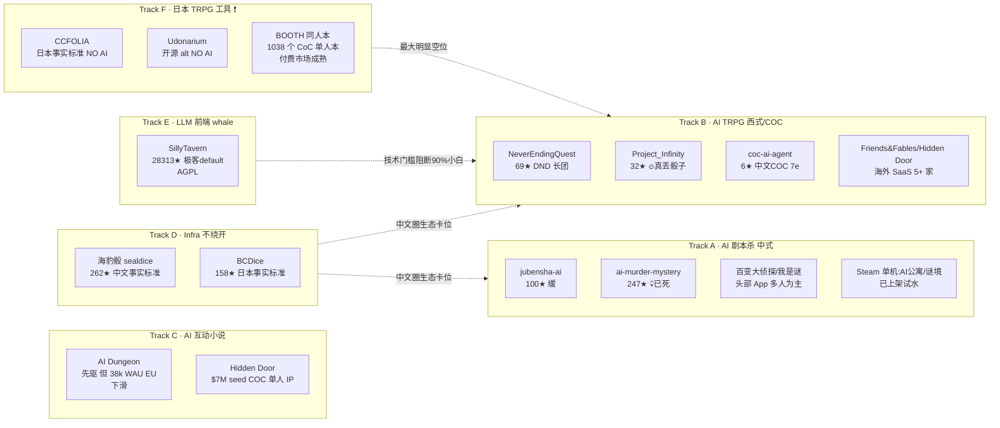

# 决策汇总：AI 剧本杀 + AI 跑团 赛道入场判断

> **调研日期**：2026-05-26
> **调研主题**：用户想做"玩家端·AI 当 DM·MVP 单人本"，要评估赛道空间 + MVP 切口
> **数据规模**：扫描 OSS 候选 60+ 个 → 深度分析 19 个；闭源候选 12+ 个；同人本平台 5 个

---

## 一句话调研背景

**目标**：判断"做一个 AI 当 KP 跑 COC 单人本"的产品有没有空位、用户付费、生态空间，以及 MVP 该切哪个角度。

---

## 竞品格局图

---

## 关键数字看板

| 指标 | 数据 | 含义 |
|---|---|---|
| OSS 顶端 ★ (同赛道) | 247 (已死) / 100 (缓) | **无事实标准、无 5k★ 王者** |
| 中式 AI 剧本杀 OSS 数 | 4+ 个 ≥10★ | 早期 hobby 阶段 |
| 海外 AI TRPG SaaS 数 | 5+ 家在抢 | AI Dungeon / Friends & Fables / Hidden Door 等 |
| AI Dungeon 用户数 | 1.5M MAU 峰值 (2021) → 38K WAU 欧洲 (2024) | **明显下滑** |
| Hidden Door 融资 | $7M seed | 已做 COC 单人 IP |
| 中式 AI 剧本杀单机 (Steam) | 2 款已上架 | **方向已被试水** |
| 中式 App 头部 | 百变大侦探 + 我是谜 | 多人为主，单人是 onboarding |
| 日本 BOOTH CoC 单人本 | 1038 个 | **付费市场，¥100-¥1000/本** |
| 中文 Lofter 单人本 | 大多免费 | **作者爱发电，无付费基础设施** |
| TTRPG 全球市场 | $2.4B (2026) → $6.6B (2035) | 增长预期强 |
| 中文 TRPG 骰子机器人 | sealdice 262★ | **绕不开** |
| 日本 TRPG 工具 AI 集成 | **0 个** | **最大明显空位** |

---

## 决策矩阵

| 角度 | 商业空间 | 技术难度 | 时间窗口 | 用户付费 | 综合 |
|---|---|---|---|---|---|
| **A. 中文 AI 剧本杀 单人** | ⭐⭐⭐ Steam 已 2 款，App 头部强 | ⭐⭐⭐ 内容工程重 | ⚠️ 窗口在收缩 | ⭐⭐ 国内付费弱 | **⭐⭐⭐** 拥挤 |
| **B. 中文 AI 跑 COC 单人本** | ⭐⭐⭐⭐ 真空 + 用户痛点真实 | ⭐⭐⭐⭐ 规则准确 + 内容版权两难 | ⭐⭐⭐⭐ 12-18 月窗口 | ⭐⭐ 国内付费弱但核心爱好者愿意 | **⭐⭐⭐⭐** 切口最准 |
| **C. 日文 AI 跑 COC 单人本（出海）** | ⭐⭐⭐⭐⭐ 完全真空 + 1038 个现成本子付费市场 | ⭐⭐⭐⭐⭐ 日语本土化 + 文化壁垒 | ⭐⭐⭐⭐ 12 月内必抢 | ⭐⭐⭐⭐⭐ 日本付费意愿强 | **⭐⭐⭐⭐⭐** 最大蓝海，但门槛高 |
| **D. 海外 AI TRPG SaaS 复刻** | ⭐⭐ 已 5+ 家在抢 | ⭐⭐⭐ | ❌ 窗口已闭 | ⭐⭐⭐ | **⭐⭐** 红海 |
| **E. 海豹骰 AI 插件**（生态打法） | ⭐⭐⭐⭐ 直接卡位 sealdice 用户 | ⭐⭐ 工程小 | ⭐⭐⭐⭐⭐ 没人在做 | ⭐⭐ 用户白嫖 | **⭐⭐⭐⭐** ROI 最高，但难赚钱 |
| **F. 通用 AI 跑团平台**（对标 SillyTavern + 小白化） | ⭐⭐⭐⭐⭐ 真空 | ⭐⭐⭐⭐⭐ scope 太大 | ⭐⭐⭐ | ⭐⭐⭐ | **⭐⭐⭐** scope 控制不住 |

---

## 一句话决策

**MVP 该做的事**：用"**Project_Infinity 式的诚实派技术骨架**"（AI 只描述+判定，规则/骰子/SAN 代码确定性管），切 "**中文 COC 单人本 + 小白化**" 这条路（角度 B），**MVP 第一版 0 商业化、跑 1-2 个授权能打的现成本子 + 内置 LLM 做小白 onboarding，目标是 6 周内能拿出来给 10 个真实 COC 玩家测试**。**出海日本（角度 C）作为 Plan B 备着，但 MVP 不动**。**绝对不做角度 D**。

---

## 致命决策点（必须立刻想清楚的）

1. **现成本子授权怎么搞？** — 中文 Lofter 作者多是个人爱好者、无付费机制。**直接谈 1-2 个作者 + 给分成承诺**比"做平台让人上传"快 10 倍。**核心是 MVP 阶段只需要 2-3 本能打的本子，不是 200 本**。

2. **海豹骰兼容路径？** — 推荐：**MVP 做独立 Web 应用，但把"导出/导入海豹骰人物卡"作为 P0**。这是中文 TRPG 圈的"通行证"，没有它进不来。

3. **AI 规则准确性怎么保证？** — **不能让 LLM 自由说"你这个检定丢 70"**。把 D100 检定、SAN check、HP/MP、技能列表全部代码确定性管。AI 只负责"描述场景 + 决定该检定哪个技能 + 描述结果"。

4. **小白 onboarding 怎么做？** — 内置 LLM 余额（产品 burn 钱）+ 一键开本 + 角色卡向导（不让用户填空白 sheet）。**SillyTavern 不做的事就是这个**。

5. **国内付费模型？** — 不要走订阅。走 **单本本子付费（¥6-15/本）+ 内置 LLM 流量包**。这跟剧本杀玩家心智更近。

---

## 下一步推荐

> **赛道信号判定**：**crowded + emerging** —— OSS 端有 4+ 个中文同赛道项目（虽然都早期），闭源端 Steam 已 2 款 + 海外 5+ 家在抢，但**没有事实标准**，**窗口仍开 12-18 月**。

### 强烈推荐：跑 `/office-hours` 验证 narrowest wedge

> office-hours 是 gstack 套件里的"6 forcing questions 验证"skill，逼用户回答"为什么是你 / 为什么是现在 / 为什么这个用户"。

**为什么需要**：调研显示赛道既不是真空也不是大红海，**找准 wedge 是生死线**。具体要验证的 5 个 wedge 候选：

| wedge 候选 | 关键假设 | 验证方法 |
|---|---|---|
| (1) 中文 COC 圈，小白化"一键开本" | 现有 SillyTavern 路径门槛高，90% 玩家进不来 | 找 5 个 COC 玩家访谈，看他们多少人用 SillyTavern |
| (2) "AI 演所有 NPC" 的剧本杀模式 (jubensha-ai 路线) | 玩家想要一个人开本，AI 演全部嫌疑人 | 找 5 个剧本杀玩家访谈 + 看 Steam AI 剧本杀单机评价 |
| (3) 海豹骰 AI 插件 | 现有海豹骰用户想要 AI Keeper 辅助 | 找 sealdice GitHub issue 区 / 用户群问 |
| (4) 日本出海 (Plan B) | 日本 COC 圈对 AI KP 真的有需求 | 调研日本 niconico / Pixiv 的 AI 跑团帖讨论 |
| (5) "诚实派" 工程路线（Project_Infinity 风格） | 玩家真的在意 AI 不瞎扯规则 | 找 COC KP 访谈，看他们是不是把 AI 当玩具用 |

### 推荐：跑 `/value-eval`（评估这个 MVP 的 Token 成本和商业空间）

具体 Token 成本估算（**这是国内付费弱的核心约束**）：
- 单局 COC 单人本 ≈ 2-3 小时 ≈ 50-80 轮对话 ≈ 30k-80k tokens（输入输出合计）
- 用 GPT-4o-mini 或 DeepSeek 输入输出约 ¥0.2-0.6/局
- 若 TTS 全开：+¥1-3/局
- **单局总成本 ¥0.5-3.5**，对应"单本售价 ¥8-15" 仍有 70%+ 毛利
- → 单位经济学**可行**，但需大量买流量摊薄获客成本

### 不推荐：现在直接 `/plan-ceo-review`

调研已经给出 MVP 切口；ceo-review 在 MVP scope 还没敲死时跑会过早。**等 office-hours 验证完 wedge 之后再 ceo-review**。

---

## 数据来源

- GitHub Search/REST API（OSS 候选 60+，深度分析 19 个）
- OSSInsight 月度星轨（截至 2026-03-01）
- WebSearch / WebFetch（中文 App 商店 + 海外 SaaS 落地页 + BOOTH/Lofter 同人本市场）
- 原始数据：`./raw-oss-metrics.json`（19 个 OSS 项目完整指标）
- 详细 9 维度分析：`./02-competitor-research-ai-trpg.md`
